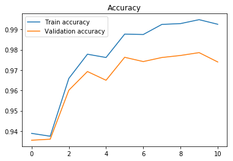
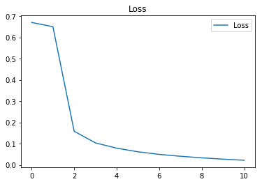
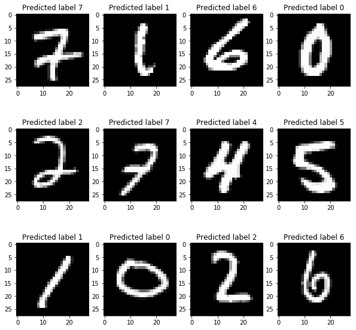
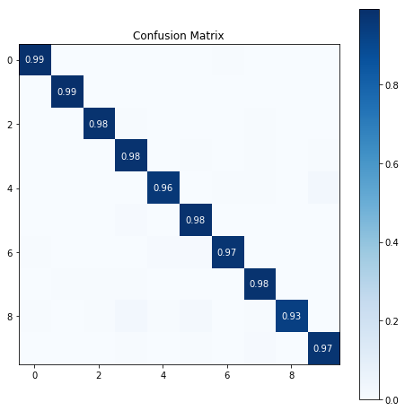

# neural_network_tuts
A feed-forward NN built from scratch with NumPy and applied on MNIST dataset

#### Project structure
There are 2 modules namely layers and nn which contains handy layers like ReLu, SoftMax, Dense etc. and a simple feed-forward neural net. There is a jupyter notebook under scripts package which runs the neural net on MNIST dataset.

#### SimpleNn
The simple_nn.SimpleNn class supports building arbitrarily complex neural net via adding layers of base type Layer. An example is there in the notebook which creates a neural net with 3 layers with ReLu activation for internal layers and softmax for the output layer.

#### Excerpts from the notebook
The model tends to converge in <10 epochs and starts overfitting after that.

##### Samples from test set with predictions

##### and the confusion matrix

